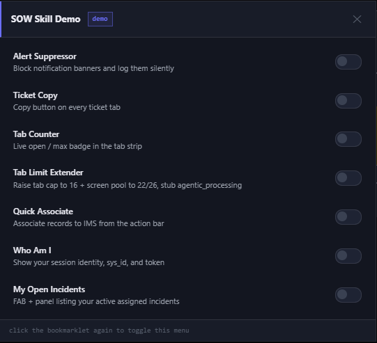
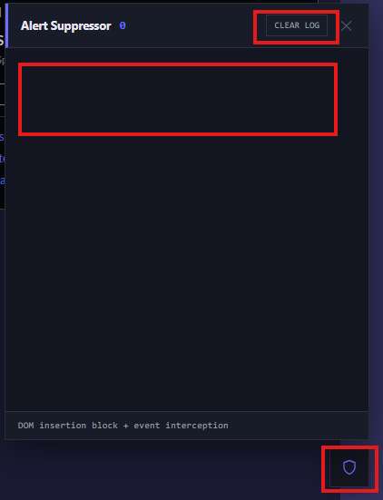
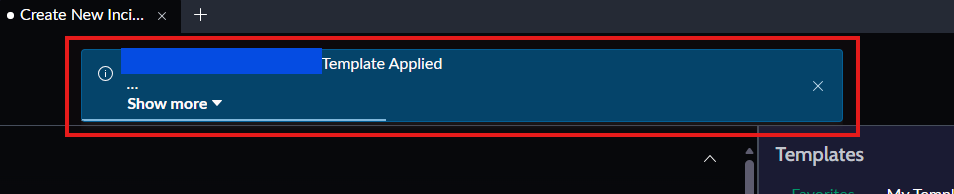
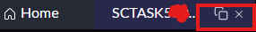
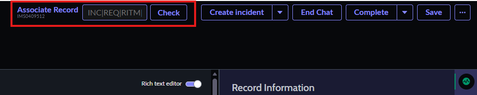

# Skill demos

Bookmarklet installer pages generated with this skill. Open an HTML file in a
browser, drag the button to your bookmarks bar, then click it on a logged-in
Service Operations Workspace page (`/now/sow/...`).

| File | What it proves |
|------|----------------|
| `sow-skill-demo.html` | Unified 7-tool toolkit with toggle menu: alert suppressor, ticket copy, tab counter, tab limit extender, quick associate, who am i, my open incidents |
| `skill-verifier.html` | Full skill claim audit (~168 read-only probes) |

---

## SOW Skill Demo

All-in-one bookmarklet with 7 toggleable tools and a draggable menu.

1. Open `sow-skill-demo.html`.
2. Drag **SOW Skill Demo** onto your bookmarks bar.
3. Click it on `/now/sow/`. The toggle menu appears.
4. Click the bookmarklet again to show/hide the menu.

### Alert Suppressor

Stops SOW notification banners from stealing focus and covering the page. Keeps
a scrollable log of every suppressed message with timestamps.

**How it works (two layers):**

- Hooks `EventTarget.dispatchEvent` to catch `NOTIFICATIONS_UPDATED` payloads
  and queue the message text.
- Patches `Node.prototype.insertBefore` / `appendChild` so `now-alert` nodes
  never stay in the DOM (hide + remove on the next microtick) -- no timer, no
  dismiss animation, no focus steal.

The shield FAB badge increments on every block. Open the panel to read the
suppressed messages. This is the kind of banner it catches:

### Ticket Copy

Adds a clipboard icon next to every ticket tab label. Shows on hover, copies
the ticket number on click with an opacity flash to confirm. Walks shadow roots
with MutationObservers and periodic re-scans to catch lazily mounted tabs.

### Tab Counter

Live `open / max` badge injected into the tab strip. Updates every 2 seconds.
Colour shifts from neutral to amber within 2 of the limit, red when full.
Auto-detects light and dark themes.

### Tab Limit Extender

Raises the workspace tab cap from 10 to 16 and the screen pool from
3 active / 5 cached to 22 / 26 by patching `tabConfig` on `sn-canvas-tabs` /
`sn-canvas-tabsdata` and `mainConfig` on `sn-canvas-main`. Reasserts every
3 seconds when the framework rewrites them. Also stubs the
`agentic_processing` endpoint that 400-errors every 6 seconds. Restores
original values on toggle off.

### Quick Associate

Input field that appears on the action bar of IMS (interaction) records.
Accepts INC, REQ, RITM, or SCTASK numbers. RITM and SCTASK resolve up the
parent chain (SCTASK -> RITM -> REQ). Shows a confirmation dropdown with the
full record tree before POSTing to `interaction_related_record`. Matches native
button styles by reading computed styles from the existing action bar buttons.
Auto-removes when you navigate away from the IMS record.

### Who Am I

One-shot draggable panel showing your session identity. Queries `sys_user` via
`javascript:gs.getUserID()` with a `current_user` fallback (`user_sys_id`, not
`sys_id`). Shows name, username, email, title, sys_id, and a token preview.

### My Open Incidents

FAB + scrollable panel listing your active assigned incidents. Queries the
`incident` table filtered by `assigned_to=javascript:gs.getUserID()` and
`active=true`. Shows ticket number, short description, state, priority, and
last updated timestamp. Click a row to open in a new tab. Refresh button to
re-query.

---

## Skill Verifier

1. Open `skill-verifier.html`.
2. Drag **Skill Verifier** onto your bookmarks bar.
3. Run it on `/now/sow/` (a record page exercises more DOM checks).
4. Click **Run all checks**, then **Copy report JSON** if you want a dump.

**Safety:** GET-only. No ticket PATCH/POST, no `order_now`, no `tabConfig`
mutation. Stops early on HTTP 429.
